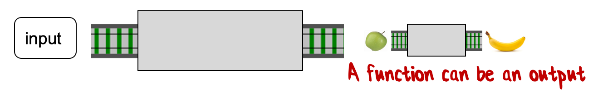
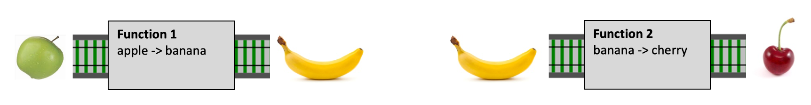
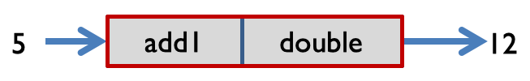
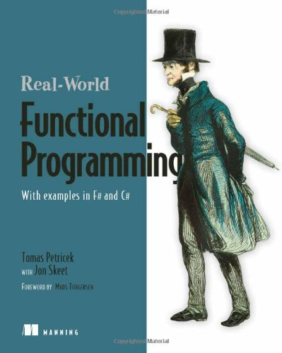

- title : F# for the C# Developer
- description : Introduction to F# and functional programming for the C# developer
- author : Nicola Iarocci
- theme : simple
- transition : none

***

***

# _Introduction to F#  and functional programming  for the C# developer_

      

**Nicola Iarocci**

Software Craftsman, MVP 
[nicolaiarocci.com](https://nicolaiarocci.com) | [@nicolaiarocci](https://twitter.com/nicolaiarocci)

***

# _Disclaimer_

## This talk is based on the excellent work by

      

**Scott Wlaschin** 
[fsharpforfunandprofit.com](https://fsharpforfunandprofit.com) | [@ScottWlaschin](https://twitter.com/ScottWlaschin)

***

# _The goal of this talk_

## Is just to demistify F# a bit

_You can't become an expert in an hour_

_I'll try not to be too biased_

' not gonna show all the features, you can learn them yourself
' I’m rather gonna show the differences in philosopy with C#

---

## Is it worth the effort learning a new language?

> A language that doesn't affect the way you think about programming, is not worth knowing - [Alan Perlis](https://en.wikipedia.org/wiki/Alan_Perlis)

 
 
 

- You dont really want to invest your time into learning new, marginally important things

- F# is a language that will change the way you think about programming

- Don’t trust people who have never looked at it. Don’t bother.

***

# _About F#_

 

- Developed by Microsoft Research
  - Shipped with Visual Studio 2010
  - History of F# @ https://fsharp.org/history/

- Open Source @ https://github.com/dotnet/fsharp

- Cross platform (Linux, macOS, Windows)
  - Works with VS Code and other editors

- Very active and friendly community
  - Start with [fsharp.org](https://fsharp.org)
  - F# Slack channel
  - #fsharp on Twitter

***

# _Differences between C# and F#_
## From least to most important

 

  - Concise syntax

- Type inference

- Different defaults

- Different philosophy

' when you learning a new language you always want to compare it with what you already know, I think that’s a bad idea. Especially if you are learning a new paradigm, you shold start with a beginners’ mind so that old stuff does not interfere. ideally when you learning a new (and totally different) language like F# you should forget C# otherwise you get frustated with why can’t I do this or that (like I used to do in C#)

' syntax is very different and tends to put c# people off
' type inference is very different fro c#
' defaults is different. everything defaults to immutability for example
' different philosophy about what is important when you program

***

# _Unique to F#_

 

  - Functional first

- Algebraic type system

- Interactivity

' interactivity like python or ruby, but in a static language

***

# _SYNTAX_

---

## Immutable C# class we'll use as an example

    [lang=cs]
    public class Person 
    {
        public Person(string name, DateTime birthday)
        {
            _name = name;
            _birthday = birthday; 
        }

        private readonly string _name;
        private readonly DateTime _birthday;

        public string Name
        {
            get { return _name; }
        }
        public DateTime Birthday 
        {
            get { return _birthday; }
        }
    }

---

## Indentation instead of curly braces

---

## Do we really need the curly braces?

    [lang=cs]
    public class Person 
    {
        public Person(string name, DateTime birthday)
        {
            _name = name;
            _birthday = birthday; 
        }

        private readonly string _name;
        private readonly DateTime _birthday;

        public string Name
        {
            get { return _name; }
        }
        public DateTime Birthday 
        {
            get { return _birthday; }
        }
    }

---

## Indentation gives us all the clues we need

    [lang=cs]
    public class Person =

        public Person(string name, DateTime birthday) =

            _name = name;
            _birthday = birthday; 

        private readonly string _name;
        private readonly DateTime _birthday;

        public string Name = 

            get { return _name; }

        public DateTime Birthday =

            get { return _birthday; }

---

## Use '=' to start blocks

    [lang=cs]
    public class Person =

        public Person(string name, DateTime birthday) =

            _name = name;
            _birthday = birthday; 

        private readonly string _name;
        private readonly DateTime _birthday;

        public string Name = 

            get { return _name; }

        public DateTime Birthday =

            get { return _birthday; }

---

## Shift up to use less vertical space

    [lang=cs]
    public class Person =

        public Person(string name, DateTime birthday) =
            _name = name;
            _birthday = birthday; 

        private readonly string _name;
        private readonly DateTime _birthday;

        public string Name = 
            get { return _name; }

        public DateTime Birthday  =
            get { return _birthday; }

---

> Python's use of whitespace stopped feeling unnatural after about twenty
minutes. I just indented code, pretty much as I would have done in a C
program anyway, and it worked - [Eric S. Raymond](https://en.wikipedia.org/wiki/Eric_S._Raymond)

---

## Automatically create backing fields from constructor parameters

---

## A lot of duplication...

    [lang=cs]
    public class Person =

        // constructor arguments match the private fields
        public Person(string name, DateTime birthday) =
            // arguments values are assigned to backing fields
            _name = name;
            _birthday = birthday; 

        // private fields declared
        private readonly string _name;
        private readonly DateTime _birthday;

        public string Name = 
            // field value finally returned
            get { return _name; }

        public DateTime Birthday  =
            // field value finally returned
            get { return _birthday; }

---

## Use the constructor params directly
 
    public class Person =

        public Person(string name, DateTime birthday) =
            ...

        public string Name = 
            get { return name; }

        public DateTime Birthday =
            get { return birthday; }
  
' primary constructors were a short lived feature in VS2014, removed from c# prior to 2015

---

## Merge the primary constructor with the class definition

---

## How often do you have more than one constructor?
 
    public class Person =

        // enquiring minds want to know
        public Person(string name, DateTime birthday) =
            ...

        public string Name = 
            get { return name; }

        public DateTime Birthday =
            get { return birthday; }
  
---

## Why not merge the constructor with the class definition?
 
    public class Person(string name, DateTime birthday) =

        public string Name = 
            get { return name; }

        public DateTime Birthday =
            get { return birthday; }

----

## Reduced syntax noise

---

## Class is immutable, every property is 'get' only
 
    public class Person(string name, DateTime birthday) =

        public string Name = 
            get { return name; }

        public DateTime Birthday =
            get { return birthday; }
---

## 'get' is gone!
 
    public class Person(string name, DateTime birthday) =

        public string Name = 
            return name; 

        public DateTime Birthday =
            return birthday;

---

## Who even likes typing semicolons anyway?
 
    public class Person(string name, DateTime birthday) =

        public string Name = 
            return name; 

        public DateTime Birthday =
            return birthday;
---

## Semicolons gone!
 
    public class Person(string name, DateTime birthday) =

        public string Name = 
            return name

        public DateTime Birthday =
            return birthday
----

## Implicit 'return'

---

## F# is an expression-oriented language

    public class Person(string name, DateTime birthday) =

        public string Name = 
            return name

        public DateTime Birthday =
            return birthday

' f# is an expression-oriented language. everything is an expression, and expresions always returns something
' in c# you have actions and funcs, in f# you only have funcs

---

## The return is implict for the last line in a block

    public class Person(string name, DateTime birthday) =

        public string Name = 
            name

        public DateTime Birthday =
            birthday

---

## Members are public by default

---

## The properties are immutable

    public class Person(string name, DateTime birthday) =

        public string Name = 
            return name

        public DateTime Birthday =
            return birthday

---

## No explicit 'public' is needed

    class Person(string name, DateTime birthday) =

        string Name = 
            return name

        DateTime Birthday =
            return birthday

' in f# immutable is the default, so public is default too. 
' in c# you need private/public to protect mutable stuff, and default is private
' in f# we can get rid of public (you can have private internal etc if really needed)

---

## Type Inference

---

## We have to repeat the type? Can't the compiler figure it out?

    class Person(string name, DateTime birthday) =

        // it's a string, we know from the constructor 
        string Name = 
            name

        // and this one, it ought to be a DateTime
        DateTime Birthday =
            birthday

---

## The answer is a big YES!

    class Person(string name, DateTime birthday) =

        Name = 
            name

        Birthday =
            birthday
---

## Class and method members

---

## the 'member' keyword indicates class members

    class Person(string name, DateTime birthday) =

        member this.Name = 
            name

        member this.Birthday =
            birthday
---

## 'member' also defines methods

    class Person(string name, DateTime birthday) =

        member this.Name = 
            name

        member this.Birthday =
            birthday
        
        member this.Age() =
            var daysDiff = DateTime.Today.Subtract(birthday).Days
            daysDiff / 365

' you have to use member to say a property or method is a class member
' notice that Age() method has no type declaration, compiler can figure it out. it also has no return

---

## Type annotations

---

## In C#, types come before name

    // all C-derivative languages use type-then-name syntax
    class Person(string name, DateTime birthday) =

        member this.Name = 
            name

        member this.Birthday =
            birthday
        
        member this.Age() =
            var daysDiff = DateTime.Today.Subtract(birthday).Days
            daysDiff / 365

---

## In F#, types come after name

    // most modern languages adopt type-then-name instead
    class Person(name: string, birthday: DateTime) =

        member this.Name = 
            name

        member this.Birthday =
            birthday
        
        member this.Age() =
            var daysDiff = DateTime.Today.Subtract(birthday).Days
            daysDiff / 365
---

## Different keywords

---

## In C#, we use 'class' and 'var'

    // 'class' identifies - you guessed it - a class
    class Person(name: string, birthday: DateTime) =

        member this.Name = 
            name

        member this.Birthday =
            birthday
        
        member this.Age() =
            // 'var' is C#'s type-inference declaration
            var daysDiff = DateTime.Today.Subtract(birthday).Days
            daysDiff / 365
---

## In F#, we use 'type' and 'let'

    // 'type' identifies - you guessed it again! - F# types
    type Person(name: string, birthday: DateTime) =

        member this.Name = 
            name

        member this.Birthday =
            birthday
        
        member this.Age() =
            // 'let' is how you declare stuff in F#'s
            let daysDiff = DateTime.Today.Subtract(birthday).Days
            daysDiff / 365

---

## Modern C# equivalent with auto-properties and expression-bodied members

    class Person(string name, DateTime birthday) 
    {
        public string Name { get; } = name;

        public DateTime Birthday { get; } = birthday;

        public int Age() => DateTime.Today.Subtract(birthday).Days / 365;
    }

    // Actually, this does not work. Primary constructors was 
    // a short-lived feature that only existed in VS2014

- surprising similar
- not a coincidence

---

## Functional approach: separate the data from the functions

    type Person = {
        Name: string
        Birthday: DateTime
        }

    let age person =
        let daysDiff = DateTime.Today.Subtract(person.Birthday).Days
        daysDiff / 365

    // age : Person -> int 
    // (the inferred type of the function)

' all these differences in functional programming syntax are not really fundamental, because in FP you separate data form functions.
' functions that act on the data are separate from the data itself
' record type looks a bit like json; an immutable data struct with 2 properties and no behaviour. like a C# DTO.
' looks like python, but unlike python it is strictly typed; it will not compile if you make an error

---

# Observation
## Syntax is never the most important thing about a programming language. But...

## 21 lines of code has shrunk to 5 lines of code

## You write 1/3 as much code

' again syntax is not important but conciness is

---

***

# _Type inference_

---

    let doSomething f x =
        let y = f (x + 1)
        "hello" + y

    // two parameters: f & x

' f# is really strict you can’t add a float to an int, so x must be an int. also because you are passing it into f, f must be a function; y has to be a string for the same reason
' yes less typing, but more importantly less noise, more logic
' if you/ve used python or ruby etc., you already know you dont really need to look at the types all the time
' you can hover over the code and it will tell you the inferred types
' it will also report an error if you mis-match types

---

    let doSomething f x =
        let y = f (x + 1)   // x must be an int
        "hello" + y

---

    let doSomething f x =
        let y = f (x + 1)
        "hello" + y         // y must be a string

---

    let doSomething f x =
        let y = f (x + 1)   // f must be a int -> string function
        "hello" + y

---
    
## Inferred type of doSomething

    f:(int -> string) -> x:int -> string

    // 'f' is a function, it takes an int and returns a string;
    // 'x' is an int;
    // return value is a string

---

## A more complex example

    [lang=cs]
    // C# code
    public IEnumerable<IGrouping<TKey, TSource>> GroupBy<TSource, TKey>(
        IEnumerable<TSource> source,
        Func<TSource, TKey> keySelector
        )
    {
    ...
    }

    // F# code
    let GroupBy source keySelector = 
        ...

---

# Benefits of type inference

 
 
 
 

- less typing

- less noise

- more logic

***

# _Different defaults_

---

## F# has different defaults

 

- Immutable by default
  - mutable is a special case

- Non-null types/classes by default
  - nullable is a special case

- Structural equality by default
  - reference equality is a special case

- Everything must be initialized
  - *explicit is better than implicit - Zen of Python*

---

## Immutability by default

    let x = 1

    x <- 2  // Error: this value is not mutable

---

## Immutability by default

    let mutable x = 1

    x <- 2  // OK
    
' because you have to ask for mutability, you tend to use it less

---

## Not nullable by default

    type Person = {
        Name: string
        Birthday: DateTime
        }

    let x : Person = null   // Error: the type Person does not have null as a proper value

' you don’t have to write defensive code because you are guaranted that nothing is gonna be null in the first place

---

## Not nullable by default

    [<AllowNullLiteralAttribute>]
    type Person(name: string, birthday: DateTime) =
        member this.Name = name
        member this.Birthday = birthday

    let x : Person = null   // OK

    // more pain intended

---

## Structural equality

    type Person = {
        Name: string
        Birthday: DateTime
        }

    let bday = DateTime(1980,1,1)
    let alice1 = {Name="Alice"; Birthday=bday}
    let alice2 = {Name="Alice"; Birthday=bday} 

    alice1 = alice2     // true or false?

    // true.
    // never write GetHashCode $ Equals ever again!

---

## Everything must be initialized

    type Person = {
        Name: string
        Birthday: DateTime
        }

    let alice : Person          // Error

---

## Everything must be initialized

    type Person = {
        Name: string
        Birthday: DateTime
        }

    let alice = {Name="Alice"}  // Error: Birthday is required

---

## Everything must be initialized

    type Person = {
        Name: string
        Birthday: DateTime
        }

    let alice = {Name="Alice"; Birthday=DateTime(1980,1,1)}  // OK

' everything must be initialized. big difference. 
' if you add a new property all code breaks until you fix it. that’s good.
' you can trust things to be properly initialized

***

# _Different philosophy_

---

## Different philosophy

- C# historically comes from C-like approach

- F# come from ML, a MetaLanguage for proving things

' different philosophy ML desgined pretty much as the same time as C. c# imperative, f# goal is predictable code (scientific)
' in OOP world you are not supposed to know behaviour of an object
' for performance you  might prefer mutability alright (array of customer) so there are use cases wher mutability if important, but most of the time given modern hardware and software and compiler optimization, predictability is preferrable over performance
' you dont write defensive code in f#
' that’s another reason why code is shorter
' in f# you should not throw for flow control

---

## Goal: Predictable code

- Can you understand the code using only the information that you have *right in front of you?*

- You're not allowed to delve into other parts of the codebase.

---

## Tricky question

    var x = 1;
    DoSomething(x);

    var y = "hello" + x;    // What value is y?

    // The answer is "hello world".

---

## Tricky question

    function DoSomething (foo)  { x = "world"; }

    var x = 1;
    DoSomething(x);

    var y = "hello" + x;    

    // The code is actually JavaScript.

    // Thanks to static typing, this can never happen in C#.

---

## Predictable language

- Variables should not be allowed to change their type

---

    // create two customers
    var cust1 = new Customer(99, "J Smith");
    var cust2 = new Customer(99, "J Smith");

    cust1 == cust2;     // true or false?

    // You can't tell. Not predictable.

---

## Predictable language

- Variables should not be allowed to change their type
- *Objects with the same values should be equal by default.*

---

    // create a customer and an order
    var cust = new Customer(99, "J Smith");
    var order = new Order(99, "J Smith");

    cust.Equals(order);     // true or false?

    // This is probably a bug.
    // Why are you attempting to compare an order to a customer?

---

## Predictable language

- Variables should not be allowed to change their type
- Objects with the same values should be equal by default.
- *Comparing objects of different types is a compile-time error.*

---

    // create a customer
    var cust = new Customer();

    Console.WriteLine(cust.Address.Country)  // what is the expected output?

    // You can't tell. Not predictable.
    // What if Address is not always required?

---

## Predictable language

- Variables should not be allowed to change their type
- Objects with the same values should be equal by default.
- Comparing objects of different types is a compile-time error.
- *Objects must always be initialized to a valid state. Not doing so is a compile-time error.*

---

    // create a customer
    var cust = new Customer(99, "J Smith");

    // add it to a set
    var processedCustomers = new HashSet<Customer>();
    processedCustomers.Add(cust);

    // process it
    ProcessCustomer(cust);

    processedCustomers.Contains(cust);  // true or false?

    // You can't tell. Not predictable.
    // If ProcessCustomer mutates the customer, it might change the hash

---

    // create a customer
    var cust = new ImmutableCustomer(99, "J Smith");

    // add it to a set
    var processedCustomers = new HashSet<ImmutableCustomer>();
    processedCustomers.Add(cust);

    // process it and return the changes
    var changedCustomer = ProcessCustomer(cust);

    processedCustomers.Contains(cust);  // true or false?

    // true.
    // Immutability forces changed values to be returned explicitly.
    // Original value unchanged.

---

## Predictable language

- Variables should not be allowed to change their type
- Objects with the same values should be equal by default.
- Comparing objects of different types is a compile-time error.
- Objects must always be initialized to a valid state. Not doing so is a compile-time error.
- *Once created, objects and collections must be immutable.*

---

    // create a repository
    var repo = new CustomerRepository();

    // find a customer by id
    var customer = repo.GetById(42);

    Console.WriteLine(customer.Id); // what is the expected output?

    // You can't tell. Not predictable.
    // What happens if the customer is missing?
    // Is the customer null or what?

---

    // create a repository
    var repo = new CustomerRepository();

    // find a customer by id
    var customerOrError = repo.GetById(42);

    // handle both cases
    if (customerOrError.IsCustomer)
        Console.WriteLine(customerOrError.Customer.Id);

    if (customerOrError.IsError)
        Console.WriteLine(customerOrError.ErrorMessage);

    // Instead, build error cases into the return type.

---

## Predictable language

- Variables should not be allowed to change their type
- Objects with the same values should be equal by default.
- Comparing objects of different types is a compile-time error.
- Objects must always be initialized to a valid state. Not doing so is a compile-time error.
- Once created, objects and collections must be immutable.
- *Missing data or errors must be made explicit. No nulls allowed.*

---

## Predictable language

- Variables should not be allowed to change their type
- Objects with the same values should be equal by default.
- Comparing objects of different types is a compile-time error.
- Objects must always be initialized to a valid state. Not doing so is a compile-time error.
- Once created, objects and collections are *generally* immutable.
- Missing data or errors are *generally* made explicit. *Nulls are a code smell*.

---

# Predictable language
## F# is not perfect. But conventions lead this way.

***

# _Functional first_

---

## Core principles of functional programming

- _Functions_

- _Composition_

- _Parameterization_

---

# Principle
## Functions are things

- Functions are standalone things

- Hence, they are not attached to a class

---

---

---

---

---

---

- Functions can be used for inputs and outputs of other functions

- From this simple foundation we can build **complex** things

---

# Principle
## Functions can be composed together

---

---

---

---

---

## Composition in F#

    let add1 x = x + 1
    let double x = x + x

    let add1_double = 
        add1 >> double

    let x = add1_double 5   // Outputs 12

---

## Composition in F#

    let add1_double_square = 
        add1 >> double >> square

    let x = add1_double_square 5    // Outputs 144

---

## Composition in C#

    Func<int, int> add1 = x => x + 1;
    Func<int, int> doubl = x => x + x;
    Func<int, int> square = x => x * x;

    var composed = 
        add1.Compose(doubl).Compose(square);

    composed(5);

---

## Nesting functions

    add1 5                    // = 6
    double (add1 5)           // = 12
    square (double (add1 5))  // = 144

    // Standard way of nesting function calls can be confusing if too deep

---

## Piping in F# (*|>*)

    5 |> add1                     // = 6
    5 |> add1 |> double           // = 12
    5 |> add1 |> double |> square // = 144

    // Pipe operator pipes a value through a set of functions 
    // in sequence and returns the resulting value

 
 

---

## Piping in C# (if we really wanted to)

    [lang=cs]
    Func<int, int> Add1 = x => x + 1;
    Func<int, int> Double = x => x + x;
    Func<int, int> Square = x => x * x;

    5.Pipe(Add1);                           // = 6
    5.Pipe(Add1).Pipe(Double);              // = 12
    5.Pipe(Add1).Pipe(Double).Pipe(Square); // = 144

    // Pipe() is a helper method we have to write ourselves

---

## Why we say F# is "functional first"

- F# makes functional programming easy

- C# makes FP possible
    - but it's awkward and not idiomatic

---

# Principle
## Parameterization

---

    let printList() = 
        for i in [1..10] do
            printfn "the number is %i"

    // [1..10] is hard-coded data. Yuck!

---

    let printList aList = 
        for i in aList do
            printfn "the number is %i" i

    // It's second nature to parameterize the data input
    // However...

---

    let printList aList = 
        for i in aList do
            printfn "the number is %i" i

    // Hard-coded behaviour. Yuck!
    // FPers would parameterize the action as well.

---

    let printList anAction aList = 
        for i in aList do
            anAction i
    

    // We've decoupled the behavior from the data. 
    // Any list, any action!

    // F# helps by making this trivial to do.

    
---

    public static int Product(int n)
    {
        int product = 1;
        for (int i = 1; i <= n; i++)
        {
            product *= i;
        }
        return product;
    }

    public static int Sum(int n)
    {
        int sum = 0;
        for (int i = 1; i <= n; i++)
        {
            sum += i;
        }
        return sum;
    }

    // Don't Repeat Yourself (DRY)?

---

    public static int Product(int n)
    {
        int product = 1;                // Initial value
        for (int i = 1; i <= n; i++)    // Common code
        {
            product *= i;               // Action
        }
        return product;                 // Common code
    }

    public static int Sum(int n)
    {
        int sum = 0;                    // Initial value
        for (int i = 1; i <= n; i++)    // Common code
        {
            sum += i;                   // Action
        }
        return sum;                     // Common code
    }

    // Don't Repeat Yourself (DRY)?

---

    let fold action initialValue list =
        let mutable totalSoFar = initialValue 
        for item in list do
            totalSoFar <- action totalSoFar item 
        totalSoFar 
    
    // Initial value dealt with;
    // Common code extracted;
    // Parameterized action;

---

    let product n = 
        let initialValue = 1
        let action productSoFar x = productSoFar * x
        [1..n] |> List.fold action initialValue

    let sum n = 
        let initialValue = 0
        let action sumSoFar x = sumSoFar + x 
        [1..n] |> List.fold action initialValue
    
    // Lots of collections functions like this:
    // "fold", "map", "reduce", "collect", etc.

---

# Principle
## Algebraic type system

---

## F# types can be composed

- New types are build from smaller types using:
    - AND 
    - OR 
- Types are executable documentation

---

    type FruitSalad = {
        Apple: AppleVariety
        Banana: BananaVariety
        Cherry: CherryVariety
        }
    
    // FruidSalad = One each of Apple and Banana and Cherry
    // Example: pairs, tuples, records (not yet available in C#)

---

    type Snack =
        | Apple of AppleVariety
        | Banana of BananaVariety 
        | Cherry of CherryVariety
    
    // Snack = Apple or Banana or Cherry
    // Not available in C#

---

## We accept three forms of payment: Check, Cash, Card.

- For Cash we don't need any extra information
- For Checks we need a check number
- For Cards we need a card type and card number

How would you implement this?

---

    [lang=cs]
    // Possible C# implementation

    interface IPaymentMethod 
    {..}

    class Cash() : IPaymentMethod 
    {..}

    class Check(int checkNo): IPaymentMethod
    {..}

    class Card(string cardType, string cardNo) : IPaymentMethod 
    {..}

---

    [lang=fs]
    // Possible F# implementation

    type CheckNumber = int                      // primitive type
    type CardNumber = string                    // primitive type

    type CardType = Visa | Mastercard           // OR type
    type CreditCardInfo = CardType * CardNumber // AND type

    type PaymentMethod =                        // OR type
        | Cash
        | Check of CheckNumber                  // can you guess which payment 
        | Card of CreditCardInfo                // methods are accepted?

---

    type PaymentAmount = decimal                // primitive type
    type Currency = EUR | USD                   // OR type

    type Payment = {                            // final type built from many smaller types
        Amount : PaymentAmount
        Currency: Currency
        Method: PaymentMethod
        }
    
    let payment = {                             // usage example
            Amount = PaymentAmount 100.0;
            Currency = EUR;
            Method = Check 9912345
        }

---

    type CheckNumber = int                      
    type CardNumber = string                    

    type CardType = Visa | Mastercard           
    type CreditCardInfo = CardType * CardNumber 

    type PaymentMethod =                        
        | Cash
        | Check of CheckNumber                  
        | Card of CreditCardInfo                

    type PaymentAmount = decimal                
    type Currency = EUR | USD                   

    type Payment = {                            
        Amount : PaymentAmount
        Currency: Currency
        Method: PaymentMethod
        }

    // F# types are executable documentation

---

# Principle
## Interactivity demo (if time allows)

***

## Suggested reading

---

# Getting started with F#
## Start here

- Official F# Guide: https://docs.microsoft.com/en-us/dotnet/fsharp/
- F# Foundation: https://fsharp.org/
- F# for fun and profit: https://fsharpforfunandprofit.com

***

# _Thank you _

      

**Nicola Iarocci**

Software Craftsman, MVP 
[nicolaiarocci.com](https://nicolaiarocci.com) | [@nicolaiarocci](https://twitter.com/nicolaiarocci)