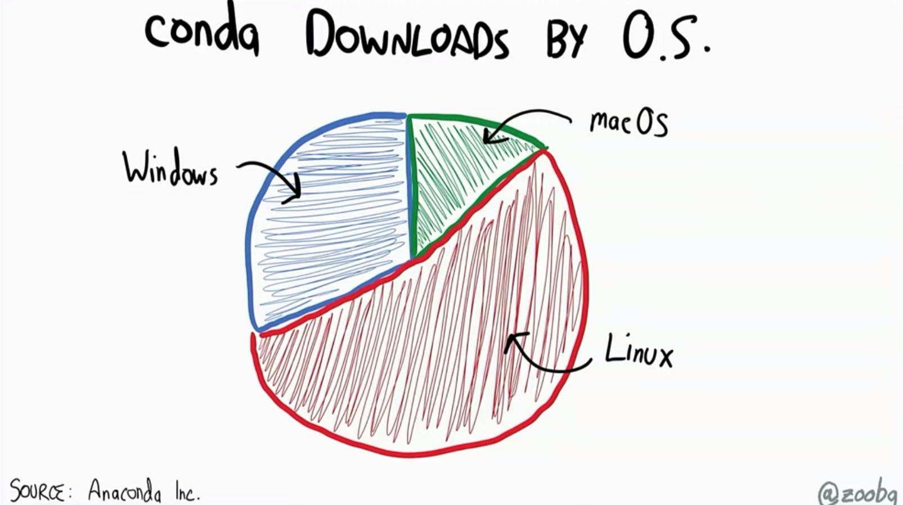
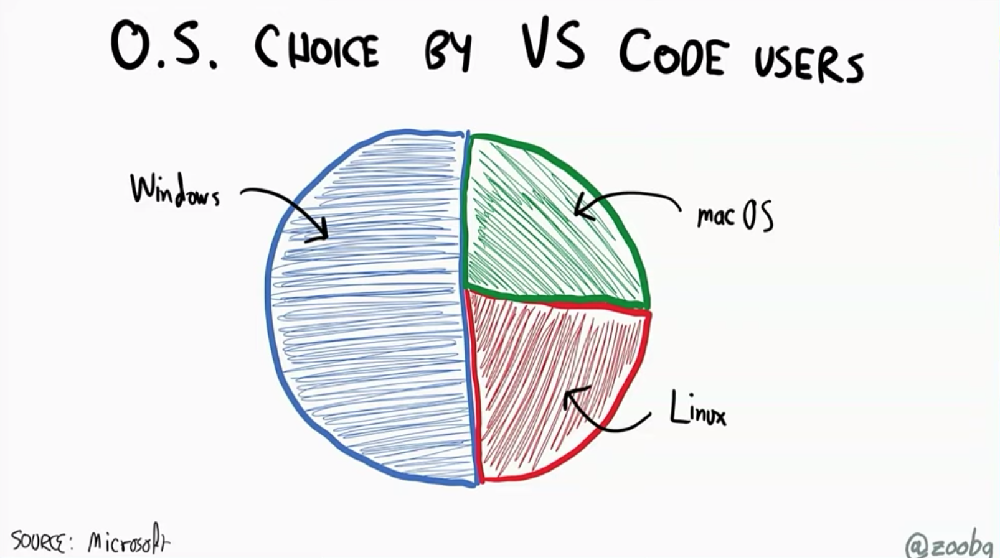
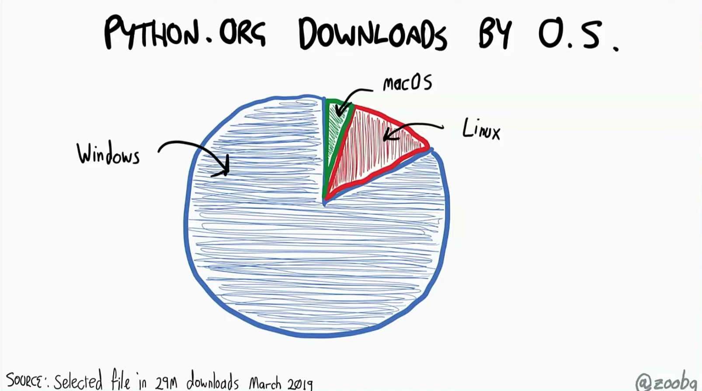

- title : Python on Windows
- description : The State of the Art of Developing with Python on Windows
- author : Nicola Iarocci
- theme : simple
- transition : none

***

# _Python on Windows State of the Art_

      

Nicola Iarocci 
[@nicolaiarocci](https://twitter.com/nicolaiarocci)

***

# Question

How many of you in this room are on Windows?

_I am not surprised_

---

# _The Goals of this talk_

## Quite ambitious ones

_1. Awareness of Windows relevance for Python_

_2. Make your code "just work" on Windows_

_3. Wonders of Python development on Windows_

_(Not kidding about #3)_

***

---

---

---

---

---

---

---

## Python userbase out there

---

## Python userbase in our perception

***

# _Thank You!_

      

Nicola Iarocci 
[@nicolaiarocci](https://twitter.com/nicolaiarocci)
