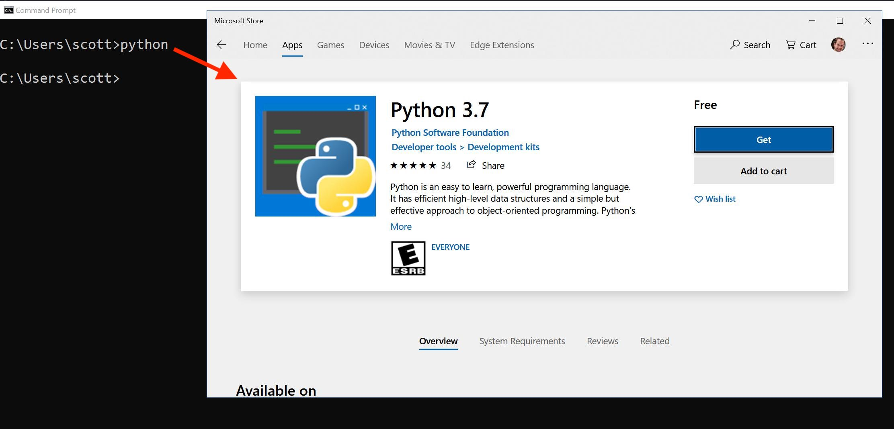

- title : Python on Windows
- description : The State of the Art of Developing with Python on Windows
- author : Nicola Iarocci
- theme : simple
- transition : none

***

# _Python on Windows State of the Art_

      

Nicola Iarocci 
[@nicolaiarocci](https://twitter.com/nicolaiarocci)

***

# Question

How many of you in this room are on Windows?

_I am not surprised_

---

# _The Goals of this talk_

## Quite ambitious ones

_1. Awareness of Windows relevance for Python_

_2. Make your code "just work" on Windows_

_3. Wonders of Python development on Windows_

_(Not kidding about #3)_

***

---

---

---

---

---

---

---

## Python userbase 

---

## Python userbase (our perception)

***

## Make sure your libs "just work" on Windows

- Make sure `-m` works on your project

- Use `pathlib.path` to handle paths

- Adopt `appdirs` to store user and configuration data

- Use `str` and let Python handle OS conversions.
  Do your own IO stream conversions

- Get CI or collaborate (we'll get back to this)

(more info at https://youtu.be/uoI57uMdDD4)

***

## _Python development on Windows_

- Python tooling has been rapidly evolving

- One-click install from the Windows Store

- Visual Studio (all editions) full support for Python

- Code+Python extension works seamlessly 

- Windows Subsystem for Linux (oh, the coolness)

- A brand new Windows Terminal

*** 

## _One-click install from the Store_

***

## _Visual Studio_

- Install Python from the VS Installer
- Package Management
- Virtual Environments
- IntelliSense and code analysis
- Interactive debugging (remote too)
- Unit Tests
- REPL
- Templates (Django, Flask, PyGame, etc.)
- Code Imports
- Jupyter, etc.
- Community edition is free and open source

_PyCharm also works great on Windows._

***

# _Thank You!_

      

Nicola Iarocci 
[@nicolaiarocci](https://twitter.com/nicolaiarocci)
