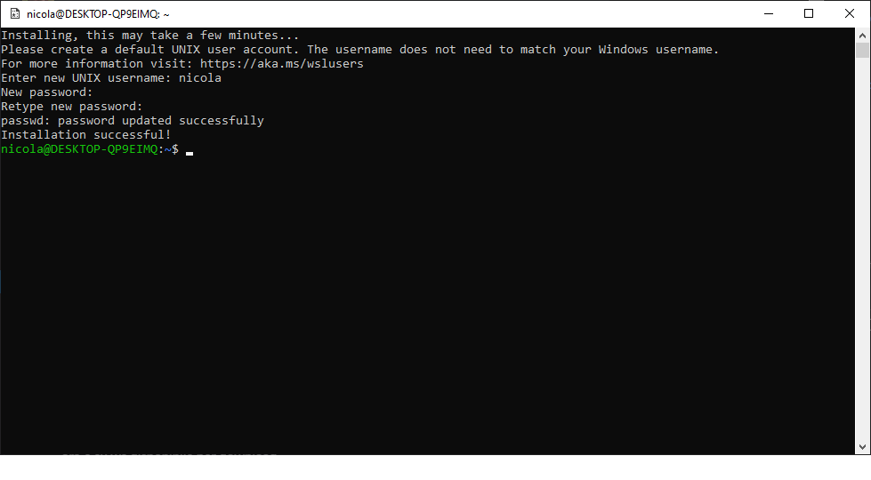
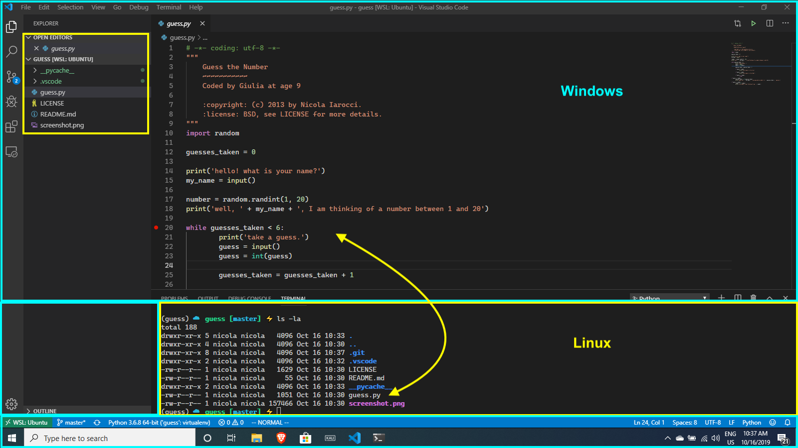
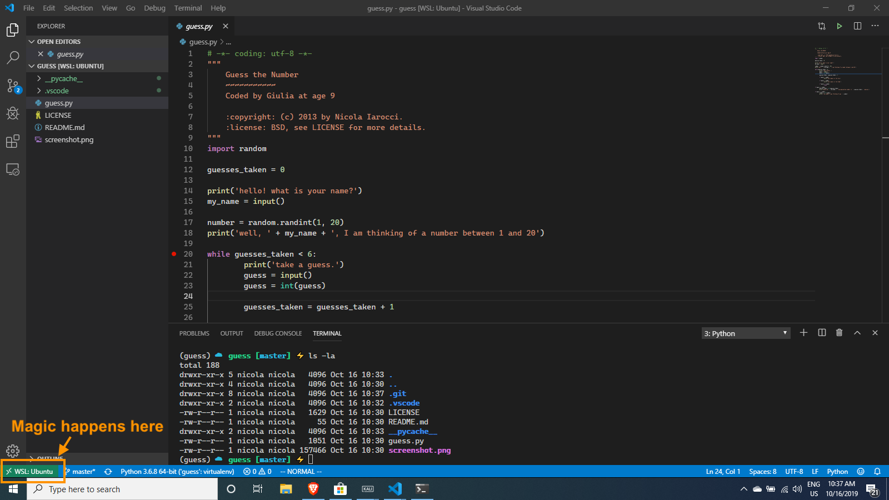
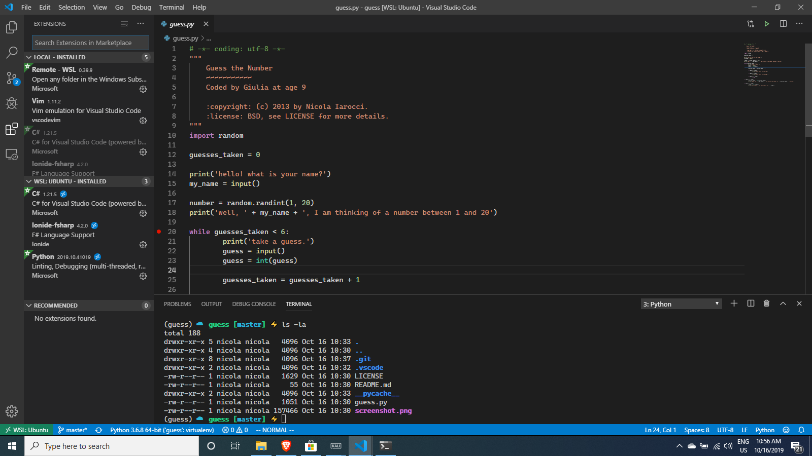
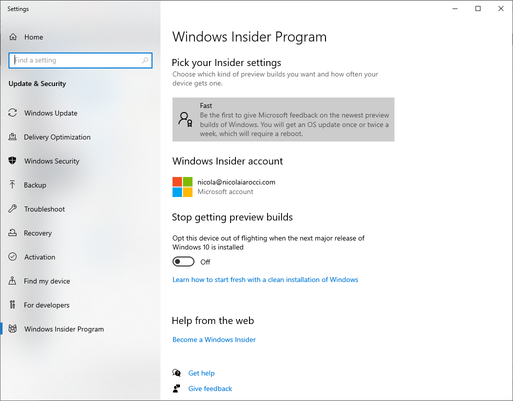
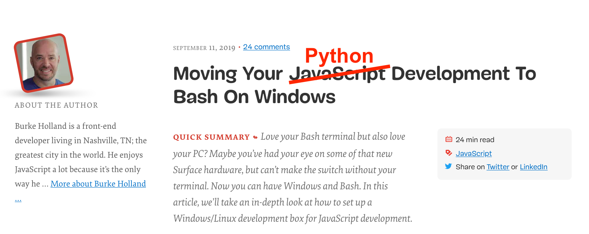

- title : Python on Windows
- description : The State of the Art of Developing with Python on Windows
- author : Nicola Iarocci
- theme : simple
- transition : none

***

# _Python on Windows State of the Art_

      

Nicola Iarocci 
[@nicolaiarocci](https://twitter.com/nicolaiarocci)

***

# Question

How many of you in this room are on Windows?

_I am not surprised_

***

# _The Goals of this talk_

## Quite ambitious ones

_1. Awareness of Windows relevance for Python_

_2. Make your code "just work" on Windows_

_3. Wonders of Python development on Windows_

_(Not kidding about #3)_

***

***

***

***

***

***

***

***

## Python userbase 

***

## Python userbase (our perception)

***

## Make sure your libs "just work" on Windows

- Make sure `-m` works on your project

- Use `pathlib.path` to handle paths

- Adopt `appdirs` to store user and configuration data

- Use `str` and let Python handle OS conversions.
  Do your own IO stream conversions

- Get CI, collaborate, or...

(more info at https://youtu.be/uoI57uMdDD4)

***

## _Python development on Windows_

- Python tooling has been rapidly evolving

- One-click install from the Microsoft Store

- Visual Studio has great Python support

- VSCode+Python extension works on Windows too

- A brand new Windows Terminal

- Windows Subsystem for Linux 2

*** 

## _One-click install from the Store_

*** 

## _Visual Studio_

- Python install from VS Installer
- Package Management
- Virtual Environments
- IntelliSense and code analysis
- Interactive debugging (remote too)
- Unit Tests
- Templates (Django, Flask, PyGame, etc.)
- Code Imports
- Jupyter support
- REPL
- Community edition is free 

_PyCharm also works great on Windows._

*** 

# _Windows Terminal (Preview)_

***

## _Windows Terminal (Preview)_

- Multiple Tabs
- Command Prompt, PowerShell, Linux
- GPU accelerated text rendering
- glyps, emojis, ideograms, symbols, icons, ligatures
- Fully configurable and custimizable via json 
- Multiple profiles
- Cascadia Code font, with ligatures (Preview)
- Terminal is Open Source ([link](https://github.com/Microsoft/Terminal)) 

(cool video at https://aka.ms/terminal-video)

***

# Windows Subsystem for Linux 2

***

# _WSL2 Quick Facts_
## Runs ELF64 Linux binaries on Windows

***

# _WSL2 Quick Facts_
## Windows ships with a Linux kernel

***

# _WSL2 Quick Facts_
## 

- WSL2 runs on a **lightweight** utility virtual machine

- Super **fast boot**, small footprint, **zero configuration**

- Both WSL2 and Linux kernel are Open Source ([link](https://github.com/microsoft/WSL2-Linux-Kernel))

***

# _One-click install of Linux distributions_

***

# _DEMO #1_
## _LINUX ON WINDOWS, WITH TERMINAL_

***

# _Code + Remote + Linux_
## _What are we looking at?_

***

# _Code + Remote + Linux_
## _Windows-side Code, connected to Linux_

***

# _Code + Remote + Linux_
## _Courtesy of Remote extension_

***

# _Code + Remote + Linux_
## _Extensions work across boundaries_

***

# _DEMO #2_
## _Code + Remote + Linux_

***

# _WSL2 IS IN PREVIEW_
## _JOIN THE INSIDER PROGRAM (Fast ring)_

***
# _You also need to know_
## _So you can avoid pain_

- BIOS virtualization must be active
- Virtual Machine Platform feature must be active
- WSL feature must be active
- distros will be on WSL1 once installed
- status: `wsl --list --verbose` _*_
- switch to v2: `wsl --set-version Ubuntu 2` _*_
- set v2 as default: `wsl --set-default-version 2` _*_

_(*) in PowerShell, as admin_

***

## _Suggested reading_ 

Smashing Magazine ([link](https://www.smashingmagazine.com/2019/09/moving-javascript-development-bash-windows/))

***

# _Thank You!_

      

Nicola Iarocci 
[@nicolaiarocci](https://twitter.com/nicolaiarocci)
